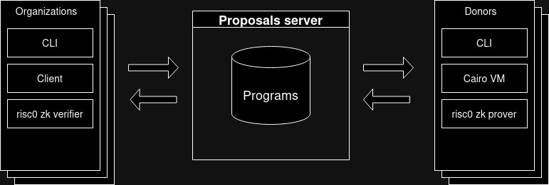

# Introduction

&nbsp;&nbsp;&nbsp;&nbsp;There are networks like [IBM World Community Grid](https://www.worldcommunitygrid.org/) where various institutions upload projects for which 
they need to perform simulations or tests on a large scale, requiring substantial computing power. 
Generally, these projects that distribute their calculations contribute to scientific work, so it is 
crucial that the results are verifiable, or one must trust in the results. Because of this, the types 
of problems to be solved should yield results that are easily validated by the user, setting 
aside potential programs that would have high computational complexity, making verification of multiple 
results unfeasible.


&nbsp;&nbsp;&nbsp;&nbsp;In the face of this problem, one approach is to use a computational integrity test generated by the 
Cairo virtual machine. This allows for addressing more complex problems with solutions whose verification 
is resource intensive. Instead of verifying the solution itself, it becomes possible to verify that the returned 
result comes from a correct execution of the virtual machine on the provided code.


&nbsp;&nbsp;&nbsp;&nbsp;The objective of this project is to create a computing donation system where different entities can 
upload Cairo code. This code is then distributed with different arguments among the various clients connecting to the server 
to donate their computing power.


&nbsp;&nbsp;&nbsp;&nbsp;The donor will download the code of the project they want to contribute to, execute it in the Cairo VM, 
which will generate the execution trace. The output will be used by the client to generate the computational integrity proof, 
which will then be sent to the system server. The server will redirect this generated proof to the entity that uploaded the 
program for execution. The entity will verify the proof and handle the aggregation of accumulated data, meaning the processing 
relevant to the obtained data based on the problem to be solved.


&nbsp;&nbsp;&nbsp;&nbsp;The project will have a server where programs to be distributed are uploaded, a Command Line Interface 
(CLI) for organizations to interact with the server and process received proofs, and a CLI for those donating their computing 
power to choose which project to contribute to and start doing so. A small example of a project to be distributed, implemented 
in Cairo, will also be included. The system will be developed using the Rust programming language and will utilize the [virtual 
machine and prover](https://github.com/lambdaclass/lambdaworks) implemented by Lambdaclass.


&nbsp;&nbsp;&nbsp;&nbsp;As a computing donation system, consideration must be given to the computer's resources, adjusting 
usage based on system resource utilization to avoid consuming resources needed by the client and hindering the operating 
system's functionality. The option to solely generate an execution of a program for uploading to the program server, 
allowing another client to generate the program proof, will also be provided.




# Usage

This set of programs make use of docker, docker-compose and makefiles.

To install docker and docker-compose, you can use the following command in ubuntu:  
```
sudo snap install docker
```

In windows, you can either install [Docker desktop](https://www.docker.com/products/docker-desktop/), or use the 
previous command inside [wsl](https://learn.microsoft.com/en-us/windows/wsl/install).

If make is not installed in the computer, try executing the command 
```
sudo apt-get install build-essential
```

If for any reason the makefiles cannot be executed, then you can execute each command individually.


## Program distributor

The server that manages the uploaders' accounts, programs, inputs and proofs. It runs an http server
and it's makefile has the following command options:

- `make`: the same as make `run_all`
- `make run_all`: executes the docker compose file, setting up the database (which has a named volume), a phpmyadmin instance for database management, and the server itself.
- `make clear_build`: clears the server's containers and building named volume making it so that the program will have to be rebuilt from zero the next time it is executed.
- `make clear_docker`: clears the containers.
- `make clear_all`: runs `clear_docker` and `clear_build`.
- `make clear_db`: deletes the volume dedicated to the database data, clearing all the stored information.

The phpmyadmin mysql database manager can be accessed (if the `PHPMYADMIN_EXTERNAL_PORT` environment variable is not modified) by entering the following url in the browser:
[http://localhost:9000/](http://localhost:9000/).

The http server can be accessed (if the `SERVER_EXTERNAL_PORT` environment variable is not modified) by entering the following url in the browser:
[http://localhost:8080/](http://localhost:8080/).

### Endpoints

Responses formats:

- Ok with response body:

```
{
    "status": "success",
    "data": null | Object, // Data returned by the endpoint
}
```

- Error with response body:
```
{
    "status": "error",
    "error_code": String, // Error code
    "error_message": String, // Error description
}
```
Error codes:

1. "ACCOUNT_NOT_FOUND"  
Status_code: 404, NOT_FOUND

2. "PROGRAM_NOT_FOUND"  
Status_code: 404, NOT_FOUND

3. "PROGRAM_NAME_TAKEN"  
Status_code: 409, CONFLICT

4. "INPUT_GROUP_NOT_FOUND"  
Status_code: 404, NOT_FOUND

5. "BAD_BASE_64_ENCODING"  
Status_code: 422, UNPROCESSABLE_ENTITY

6. "WRONG_CREDENTIALS",  
Status_code: 403, FORBIDDEN

7. "USERNAME_ALREADY_EXISTS"  
Status_code: 409, CONFLICT

8. "REFRESH_TOKEN_NOT_FOUND"  
Status_code: 404, NOT_FOUND

9. "INVALID_TOKEN"  
Status_code: 403, FORBIDDEN

10. "INTERNAL_SERVER_ERROR"  
Status_code: 500, INTERNAL_SERVER_ERROR

#### Account

- `POST` `/account/register`

Endpoint for account registration

Json body format: 
```
{
    username: String, // Username chosen by the registering user
    password: String, // Password chosen by the registering user
    name: String, // Name of the organization, this value is public
    description: String, // Name of the organization, this value is public
}
```

Response: 
```
{
    "status": "success",
    "data": null
}
```
<br>

- `POST` `/account/login`

Endpoint for account login

Json body format: 
```
{
    username: String, // Username chosen by the user logging in
    password: String, // Password chosen by the user logging in
}
```

Response: 
```
{
    "status": "success",
    "data": {
        "basic_token": {
            "token_id": String, // Id of the jwt token
            "token": String, // Jwt token
        },
        "refresh_token": {
            "token_id": String, // id of the refresh token
            "token": String, // Refresh token
        }
    }
}
```
<br>

- `POST` `/account/refresh-token`

Endpoint for jwt token refreshment

Json body format: 
```
{
    pub refresh_token: String,
}
```

Response: 
```
{
    "status": "success",
    "data": {
        "token_id": String, // Id of the jwt token
        "token": String, // Jwt token
    }
}
```
<br>

- `GET` `/account/organizations`

Endpoint to get the registered accounts

Query parameters:
```
limit: i64, // Optional, Integer from 1 to 50
page: i64, // Optional, Integer from 1 onwards
name_filter: String, // Optional, String of the beginning of the organization to filter the returned organizations
```
<br>

- `DELETE` `/account/refresh-token`

Endpoint to delete a refresh token, that is, logging out

Json body format: 
```
{
    token_id: String, // Id of the refresh token that is being deleted
}
```

Response:
```
{
    "status": "success",
    "data": {
        "organizations": [
            {
                "organization_id": String, // Organization's id
                "name": String, // Organization's public id
                "description": String, // Organization's description
            },
            ...
        ],
        "total_elements_amount": i64, // Positive integer or 0, the total amount of elements that would be
                                      // returned if there was no pagination
    }
}
```
<br>

#### Program

- `GET` `/program/all`
ProgramController::get_general_programs)).

- `GET` `/program/mine`
ProgramController::get_my_programs).wrap(ValidateJwtMiddleware)).

- `GET` `/program/template`
ProgramController::retrieve_program_template)).

- `GET` `/program/inputs/{program_id}`
ProgramController::retrieve_input_group)).

- `GET` `/program/inputs/all/{program_id}`
ProgramController::get_program_input_groups).wrap(ValidateJwtMiddleware)).

- `GET` `/program/program-and-inputs/{program_id}`
ProgramController::retrieve_program_and_input_group)).

- `GET` `/program/organization/{organization_id}`
ProgramController::get_organization_programs)).

- `GET` `/program/proof/{program_id}/{input_group_id}`
ProgramController::download_proof).wrap(ValidateJwtMiddleware)).

- `GET` `/program/proofs`
ProgramController::get_programs_with_proven_executions).wrap(ValidateJwtMiddleware)).

- `GET` `/program/proofs/{program_id}`
ProgramController::get_input_groups_with_proven_executions).wrap(ValidateJwtMiddleware)).

- `GET` `/program/{program_id}`
ProgramController::download_program)).


- `PATCH` `/program/proof/{program_id}/{input_group_id}`
ProgramController::mark_proof_as_invalid).wrap(ValidateJwtMiddleware)).

- `DELETE` `/program/{program_id}`
ProgramController::delete_program).wrap(ValidateJwtMiddleware)).

- `DELETE` `/program/proof/{program_id}/{input_group_id}`
ProgramController::confirm_proof_validity).wrap(ValidateJwtMiddleware)).

- `DELETE` `/program/input/{program_id}/{input_group_id}`
ProgramController::delete_input_group).wrap(ValidateJwtMiddleware)).

- `POST` `/program/upload"`
ProgramController::upload_program).wrap(ValidateJwtMiddleware)).

- `POST` `/program/proof`
ProgramController::upload_proof)). 

- `POST` `/program/inputs/{program_id}`
ProgramController::add_inputs_group).wrap(ValidateJwtMiddleware))


## Executor client


## Uploader client